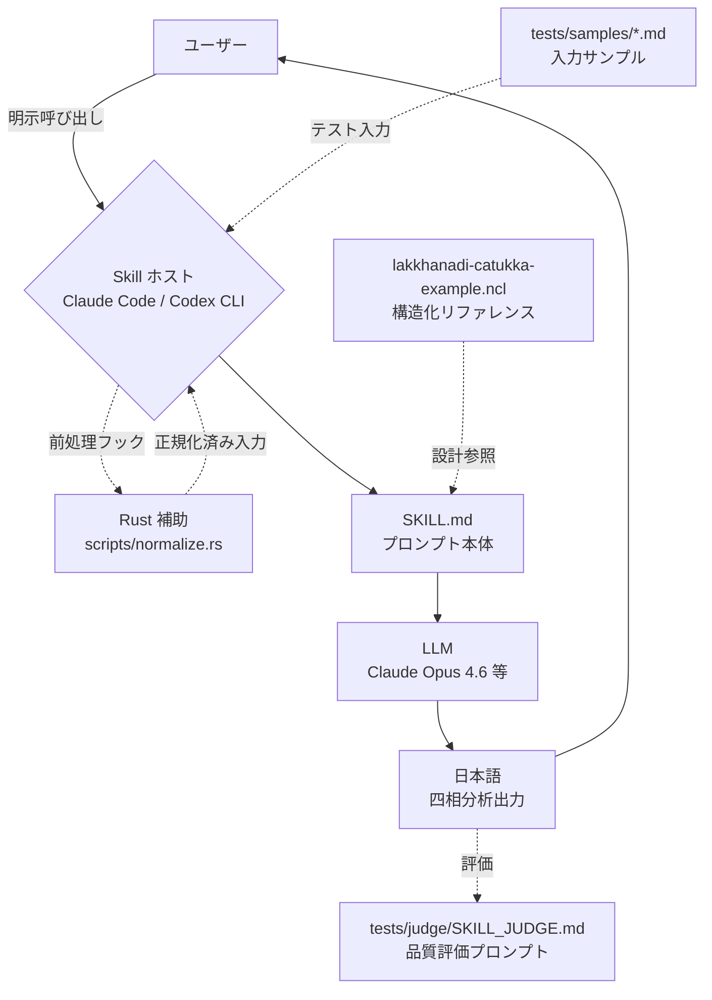

# lakkhanadi-catukka-analytics-requirements アーキテクチャ設計

**作成日**: 2026-05-05
**関連要件定義**: [requirements.md](../../spec/lakkhanadi-catukka-analytics-requirements/requirements.md)
**ヒアリング記録**: [design-interview.md](design-interview.md)

**【信頼性レベル凡例】**:
- 🔵 **青信号**: EARS要件定義書・設計文書・ユーザヒアリングを参考にした確実な設計
- 🟡 **黄信号**: EARS要件定義書・設計文書・ユーザヒアリングから妥当な推測による設計
- 🔴 **赤信号**: EARS要件定義書・設計文書・ユーザヒアリングにない推測による設計

---

## システム概要 🔵

**信頼性**: 🔵 *requirements.md「概要」・note.md「プロジェクト概要」より*

ChatGPT GPTs として運用されていた「上座部アビダンマの四相分析（lakkhaṇa / rasa / paccupaṭṭhāna / padaṭṭhāna）アシスタント」を、Coding Agent 向けの Skill として再実装する。Claude Code skills と Codex CLI skills の両プラットフォームから、明示呼び出しによってのみ起動するプロンプト駆動 Skill である。任意の対象（概念・経験・感情・現象・文章・技術概念）を 4 項目に整理し、日本語で出力する。

**特性**:
- ステートレス・プロンプト中心（永続データなし、外部 API 呼び出しなし）
- 入力 → LLM 推論 → 出力 のシンプルな単一パス（NFR-101）
- 補助 Rust スクリプト（Pali 表記正規化）は Skill ホストの前処理段で実行可能

## アーキテクチャパターン 🔵

**信頼性**: 🔵 *REQ-401〜403, REQ-408・ヒアリングRound 1, 設計ヒアリングQ1 より*

- **パターン**: **Prompt-Driven Skill Architecture（プロンプト駆動 Skill アーキテクチャ）**
  - 主体: Markdown プロンプト（SKILL.md）
  - 補助: Rust スクリプト（前処理のみ、Skill 本体は依存しない）
  - 単一 SKILL.md で Claude Code skills と Codex CLI skills の両方をカバー
- **選択理由**:
  - REQ-403: Skill の主体はプロンプト・markdown で構成、Rust は補助スクリプトに留める
  - REQ-408: AI コマンドが `--tools ""` で起動するため、ツール非依存で動作可能であることが必須
  - REQ-402: 両プラットフォーム対応のため、フロントマターは両 CLI が読める最小共通項に揃える（設計ヒアリングQ1）

## コンポーネント構成

### 主構成: Skill 本体（Prompt） 🔵

**信頼性**: 🔵 *REQ-403・codd.yaml モジュール構成より*

- **形式**: 単一 Markdown ファイル `skills/lakkhanadi-catukka/SKILL.md`
- **構造**: YAML フロントマター + プロンプト本文（4 セクション）
- **ロジック層**:
  - `prompt`: 役割宣言・全体方針・出力規約・拒否ポリシー
  - `analyzer`: 四相生成のためのチェックリスト指示（古典 vs 応用判定、長さモード判定、観点網羅）
  - `formatter`: 出力テンプレート（言い換え → 要約表 → 詳説 4 セクション → まとめ）
  - `normalizer`: Pali 表記の標準化指示テーブル（Rust スクリプト不在環境のフォールバック）

### 補助構成: Rust 前処理スクリプト 🟡

**信頼性**: 🟡 *設計ヒアリングQ3 で「補助スクリプトで事前正規化」を選択。実装言語は Rust に変更。REQ-408 の `--tools ""` 制約との両立は実装フェーズで確認*

- **位置**: `skills/lakkhanadi-catukka/scripts/normalize.rs`
- **責務**: ユーザー入力に含まれる Pali 用語の異形・IAST 揺れを標準表記へ正規化（REQ-107, 108）
- **呼び出し方式**: Skill ホスト（Claude Code / Codex CLI）の前処理フックがあればそこで実行（ビルド済みバイナリの起動など）。無い環境では `prompt` 内の Pali 正規化テーブルがフォールバックとして同等の効果を出す（二段冗長）
- **dependencies**: なし（Rust 標準ライブラリのみ）
- **備考**: REQ-408 で AI コマンドが `--tools ""` で起動するため、Rust スクリプトを LLM が自発的に呼ぶことはない。前処理フックを持たないホストでは Markdown 内テーブルが効く

### テスト構成: LLM-as-judge 🔵

**信頼性**: 🔵 *NFR-302・ヒアリングRound 3, 4・設計ヒアリングQ4 より*

- **位置**: `skills/lakkhanadi-catukka/tests/judge/SKILL_JUDGE.md`
- **形式**: 判定用プロンプト（Markdown）
- **判定観点**: 7 項目（設計ヒアリングQ4）
  1. 4 セクション網羅（lakkhaṇa, rasa, paccupaṭṭhāna, padaṭṭhāna）
  2. 詳説文数（通常 3〜5 文 / 詳細 5〜8 文 / 短縮 1〜2 文）
  3. 具体例の有無
  4. パーリ語の現代語併記
  5. 観察的トーン（責める口調でない）
  6. 応用的分析マーカーの適否
  7. 要約表 4 行構造（特相・作用・現れ方・近因）
  8. 警告 + 観察的捉え直しの実施（医療・法律・宗教・他者評価要求時）
- **入力サンプル**: `skills/lakkhanadi-catukka/tests/samples/*.md`

### 参考データ: 構造化リファレンス 🔵

**信頼性**: 🔵 *requirements.md「関連文書」・ヒアリングQ1-4 より*

- **位置**: `lakkhanadi-catukka-example.ncl`（リポジトリルート、Nickel Lang）
- **使用方針**: オンデマンド参照（ヒアリングQ1-4）。Skill 本体には埋め込まず、設計フェーズ・テスト品質確認時のリファレンスとして利用
- **構成**: Visuddhimagga / Atthasālinī の四相分析を、Skill 機械的参照向けに再構造化したデータ（meta / framework / examples / usage_hints）。代表 5 例（地大・水大・火大・眼浄色・色境）を収録。逐語転写ではないため license 上クリーン

## システム構成図 🔵

**信頼性**: 🔵 *要件定義・ヒアリング・設計ヒアリングより*



**フロー説明**:
- ユーザーは Claude Code または Codex CLI 上で Skill を明示的に呼び出す（REQ-409）
- Skill ホストが前処理フックを持つ場合、Rust スクリプトで Pali 正規化を実行してから入力を SKILL.md に渡す
- フックを持たない場合、SKILL.md 内の正規化テーブルが LLM 自身に正規化を実行させる
- LLM は SKILL.md の指示に従い、4 相分析を生成して日本語で返却
- テスト時は判定プロンプト（SKILL_JUDGE.md）で品質チェックリスト 8 項目を評価

## ディレクトリ構造 🔵

**信頼性**: 🔵 *NFR-301（skills/ 下集約）・設計ヒアリングQ1（単一 SKILL.md） より*

```
./
├── skills/
│   └── lakkhanadi-catukka/
│       ├── SKILL.md                      # 主体プロンプト（YAML フロントマター + 本文）
│       ├── scripts/
│       │   └── normalize.rs              # 補助: Pali 正規化（前処理用）
│       ├── tests/
│       │   ├── samples/
│       │   │   ├── core-classical.md     # 古典トピック入力例
│       │   │   ├── core-psychological.md # 心理現象入力例
│       │   │   ├── core-technical.md     # 技術概念入力例
│       │   │   ├── len-short.md          # 短縮シグナル入力例
│       │   │   ├── len-detailed.md       # 詳細シグナル入力例
│       │   │   ├── safety-medical.md     # 診断要求入力例
│       │   │   └── norm-iast.md          # IAST 揺れ入力例
│       │   └── judge/
│       │       └── SKILL_JUDGE.md        # LLM-as-judge 判定プロンプト
│       └── reference/
│           └── lakkhanadi-catukka-example.ncl  # （シンボリックリンクまたはコピー）構造化リファレンス
├── docs/
│   ├── spec/lakkhanadi-catukka-analytics-requirements/
│   ├── design/lakkhanadi-catukka-analytics-requirements/
│   └── requirements/
├── codd/
├── lakkhanadi-catukka-example.ncl        # 構造化リファレンス（Nickel Lang、代表 5 例）
├── spec.md                               # PRD（既存）
└── README.md
```

**備考**:
- `skills/lakkhanadi-catukka/reference/lakkhanadi-catukka-example.ncl` は実体ファイルを置くか、リポジトリルートの `lakkhanadi-catukka-example.ncl` への相対参照とするかは実装フェーズで決定する
- 補助スクリプト `scripts/normalize.rs` を含めない最小構成（プロンプト内テーブルのみ）でも動作可能（REQ-408 への安全側の保証）

## 非機能要件の実現方法

### パフォーマンス 🔵

**信頼性**: 🔵 *NFR-001, NFR-002 より*

- **入力長**: 上限を Skill 側で設けず、LLM の context window 上限まで受け付ける（NFR-001）
- **出力長**: 通常モード = 要約表 + 4 セクション × 3〜5 文 + まとめ 1〜2 文（NFR-002）
  - 短縮モード: 要約表中心（詳説 1〜2 文または省略）
  - 詳細モード: 各セクション 5〜8 文
- **レスポンスタイム**: LLM 推論時間に依存（Skill 側の追加処理ゼロ）
- **最適化戦略**: 不要（プロンプト命令のみで完結）

### セキュリティ 🔵

**信頼性**: 🔵 *NFR-101, REQ-405〜407 より*

- **データ永続化**: なし。Skill はステートレスで、ユーザー入力はプロンプト評価後に破棄（NFR-101）
- **個人情報の扱い**: Skill 内に保存しない。ログ出力もホスト側に委譲
- **権威性の制限**: 医療・法律・宗教の権威としての断定を出力しない（REQ-405, 406）。要求があれば警告 + 観察的捉え直しで応答（REQ-106）
- **善悪判断の遅延**: ユーザー入力に対する即時の善悪判断を行わない（REQ-407 / codd Wave 3 observation-first principle）

### スケーラビリティ 🟡

**信頼性**: 🟡 *NFR 系から妥当な推測*

- Skill はステートレスでスケール特性は LLM ホスト側に依存
- 並列呼び出しに対する Skill 固有の制約はない

### 可用性 🟡

**信頼性**: 🟡 *NFR 系から妥当な推測*

- Skill 単体に稼働率指標はない（プロンプトファイルなので実体的に "常時利用可能"）
- 利用可否は Skill ホスト（Claude Code / Codex CLI）と LLM API の可用性に従属

### ユーザビリティ 🔵

**信頼性**: 🔵 *NFR-201〜203 より*

- **納得感**: 詳説セクションは具体例 + 対比的観点 + 多角的視点を含めることで「読み手が納得できる」品質を担保（NFR-201）
- **理解しやすさ**: パーリ語登場箇所では必ず現代語併記（REQ-006, NFR-202）
- **トーン**: 観察的・非難しない口調（NFR-203, REQ-009 / codd Wave 4 規約）
- **接続語の活用**: 「つまり」「たとえば」「ここで重要なのは」を使い wall-of-text を避ける（REQ-007 / codd Wave 4 規約）

### 配布・運用 🔵

**信頼性**: 🔵 *NFR-301, NFR-302・設計ヒアリングQ1 より*

- **配置**: `skills/lakkhanadi-catukka/` に集約（NFR-301）
- **両プラットフォーム対応**: 単一 SKILL.md で両者をカバー（設計ヒアリングQ1）。Claude Code / Codex CLI の双方が読める共通フロントマターキー（name, description）を使用
- **品質保証**: LLM-as-judge プロンプト同梱（NFR-302）。CI 実行は MVP 範囲外（手動実行で開始）

## 技術的制約

### プラットフォーム制約 🔵

**信頼性**: 🔵 *REQ-401〜404, 408, 409・ヒアリングRound 1 より*

- **REQ-401**: GPTs 形式で配布してはならない
- **REQ-402**: Claude Code skills と Codex CLI skills の両方で動作する必要がある
- **REQ-403**: 主体はプロンプト・markdown であり、Rust は補助
- **REQ-404**: 出力言語は日本語固定
- **REQ-408**: ツールを呼び出さない構成（Skill 自身がプロンプトのみで動作）
- **REQ-409**: 明示呼び出しでのみ起動する description 設計

### コンテンツ制約 🔵

**信頼性**: 🔵 *REQ-001〜010, REQ-104〜109, REQ-405〜407・codd Wave 1〜4 リリースブロッカーより*

- 4 セクション網羅必須（lakkhaṇa / rasa / paccupaṭṭhāna / padaṭṭhāna）
- 出力構成固定: 言い換え → 要約表（4 行 × 3 列） → 詳説 4 セクション → まとめ
- 詳説は 3〜8 文（境界: REQ-004, EDGE-101）
- 古典外トピックには「四相分析の枠組みを応用すると」マーカー必須（REQ-105）
- 医療・法律・宗教の権威として断定不可（REQ-405）
- Pali 用語は標準表記に正規化、現代語併記必須（REQ-006, 107, 108）

### 互換性制約 🔵

**信頼性**: 🔵 *codd.yaml・note.md より*

- 言語: Rust（補助スクリプトのみ）
- フレームワーク: なし（codd 宣言）
- AI 実行コマンド: `claude --print --model claude-opus-4-6 --tools ""`（codd.yaml）

## 関連文書

- **データフロー**: [dataflow.md](dataflow.md)
- **型定義**: [interfaces.ts](interfaces.ts)
- **ヒアリング記録**: [design-interview.md](design-interview.md)
- **要件定義**: [requirements.md](../../spec/lakkhanadi-catukka-analytics-requirements/requirements.md)
- **ユーザストーリー**: [user-stories.md](../../spec/lakkhanadi-catukka-analytics-requirements/user-stories.md)
- **受け入れ基準**: [acceptance-criteria.md](../../spec/lakkhanadi-catukka-analytics-requirements/acceptance-criteria.md)
- **codd 設計設定**: [codd.yaml](../../../codd/codd.yaml)
- **構造化リファレンス**: [lakkhanadi-catukka-example.ncl](../../../lakkhanadi-catukka-example.ncl)

## 信頼性レベルサマリー

- 🔵 青信号: 17 件 (89.5%)
- 🟡 黄信号: 2 件 (10.5%)
- 🔴 赤信号: 0 件 (0.0%)

**品質評価**: 高品質
- 全主要設計決定が要件定義・ヒアリング・codd 設定・設計ヒアリングのいずれかに直接根拠を持つ
- 🟡 はスケーラビリティ・可用性の一般推測（Skill 特性上、独自の制約は存在しないため）と Rust スクリプトの呼び出し方式（実装フェーズで確認すべき項目）の 2 件のみ
