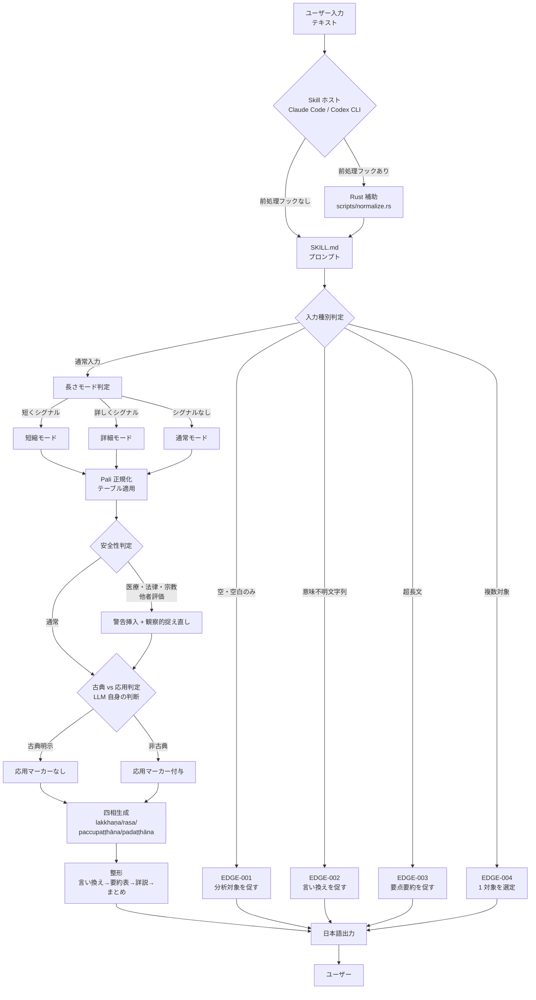
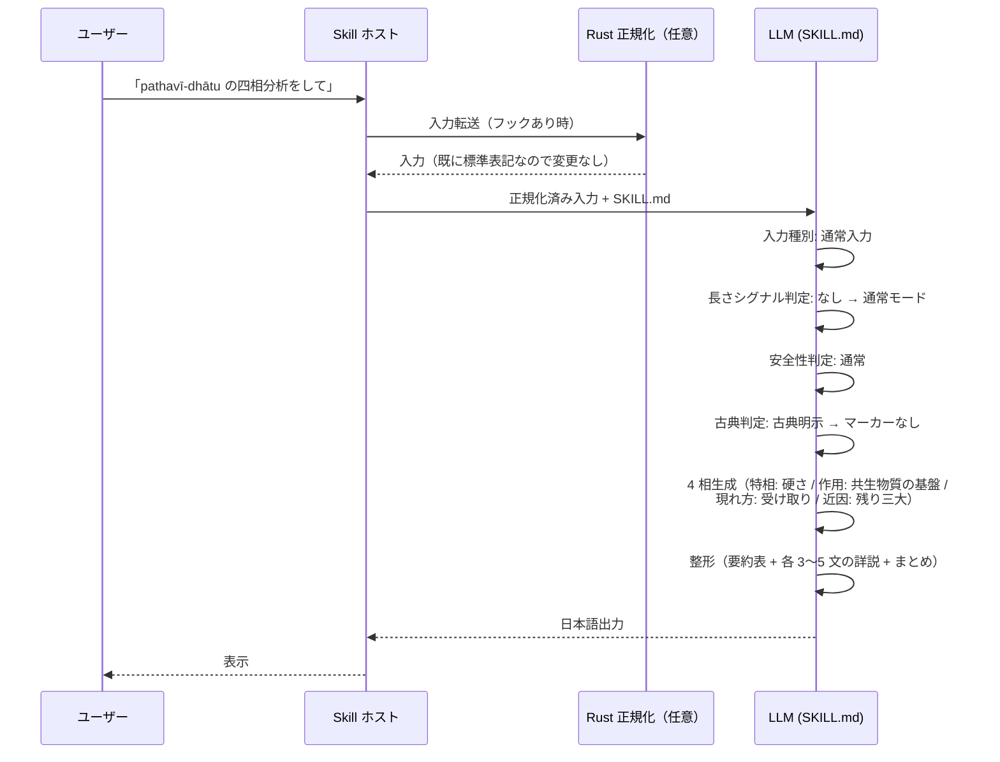
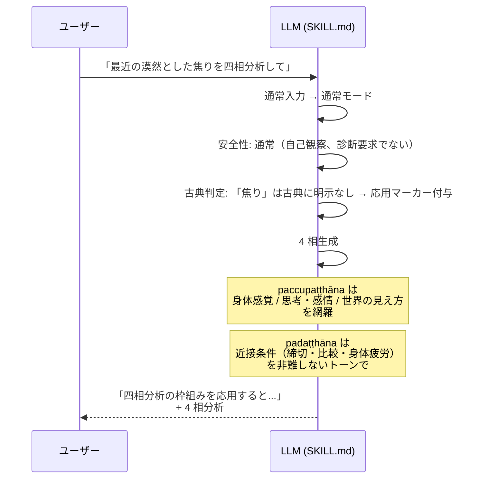
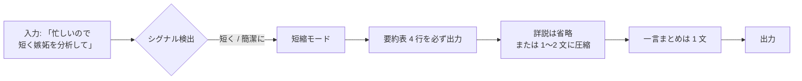
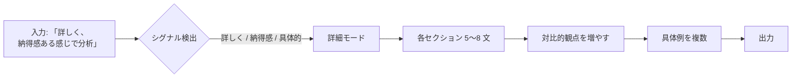
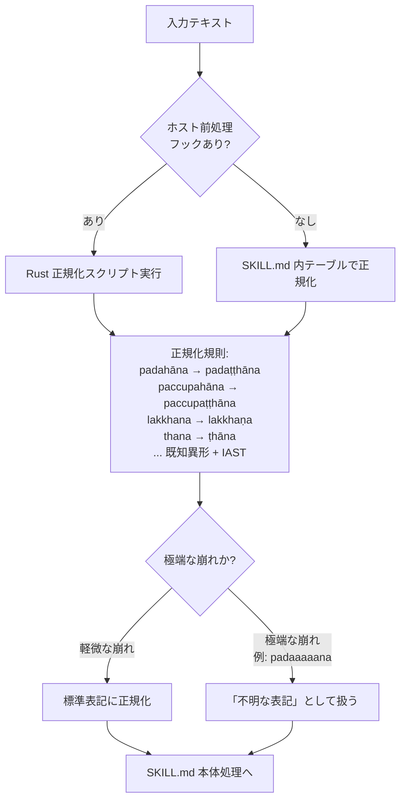
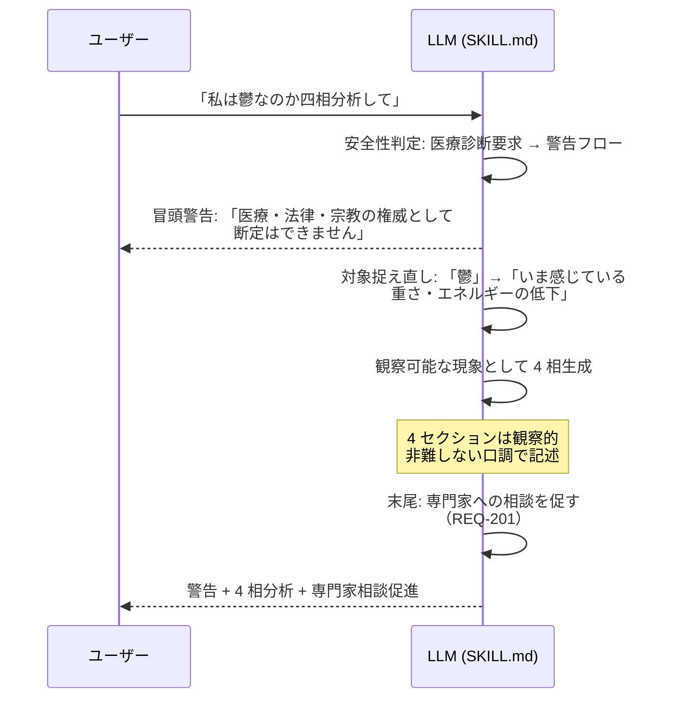
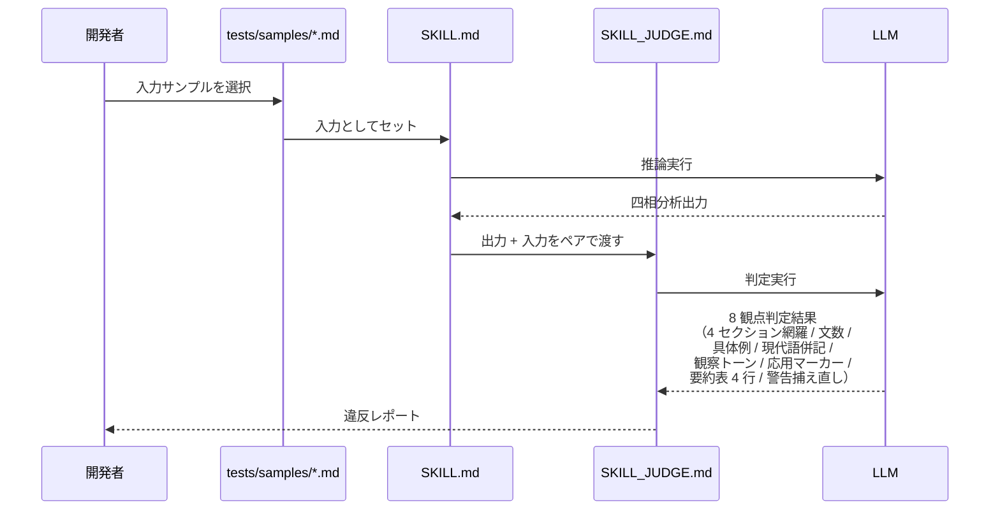
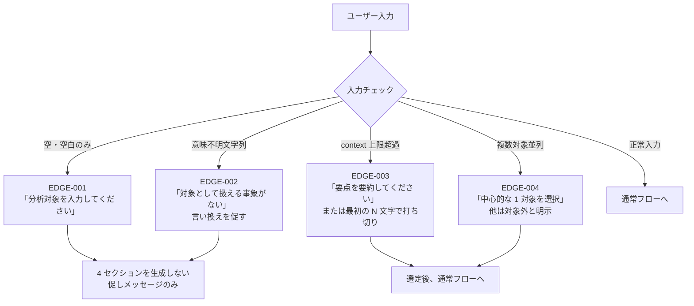
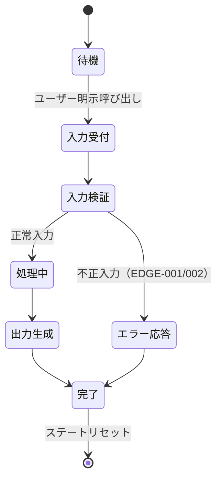

# lakkhanadi-catukka-analytics-requirements データフロー図

**作成日**: 2026-05-05
**関連アーキテクチャ**: [architecture.md](architecture.md)
**関連要件定義**: [requirements.md](../../spec/lakkhanadi-catukka-analytics-requirements/requirements.md)

**【信頼性レベル凡例】**:
- 🔵 **青信号**: EARS要件定義書・設計文書・ユーザヒアリングを参考にした確実なフロー
- 🟡 **黄信号**: EARS要件定義書・設計文書・ユーザヒアリングから妥当な推測によるフロー
- 🔴 **赤信号**: EARS要件定義書・設計文書・ユーザヒアリングにない推測によるフロー

---

## システム全体のデータフロー 🔵

**信頼性**: 🔵 *requirements.md・user-stories.md・architecture.md より*

## 主要機能のデータフロー

### フロー 1: 古典トピックの正統な四相分析（通常モード） 🔵

**信頼性**: 🔵 *user-stories.md ストーリー1.1・TC-CORE-01・TC-MARK-01 より*

**関連要件**: REQ-001〜010, REQ-103, REQ-104

**詳細ステップ**:
1. ユーザーが Skill を明示呼び出し（REQ-409）
2. Skill ホストが入力を SKILL.md に渡す（前処理フックがあれば Rust 正規化を経由）
3. SKILL.md は入力種別を判定（空 / 意味不明 / 超長文 / 複数 / 通常）→ 通常入力と判定
4. 長さシグナルを検出（「短く」「詳しく」「具体的に」「納得感」等のキーワード）→ なし → 通常モード
5. 安全性判定（医療診断・宗教断定・他者評価）→ 通常
6. 古典トピック判定（LLM の知識による）→ 古典明示 → 応用マーカーなし
7. 4 相生成 → 整形 → 日本語で出力

### フロー 2: 心理現象の応用的四相分析 🔵

**信頼性**: 🔵 *user-stories.md ストーリー1.2・TC-CORE-02・TC-MARK-02 より*

**関連要件**: REQ-001〜010, REQ-105, REQ-009, NFR-203

### フロー 3: 短縮モード（要約表中心） 🔵

**信頼性**: 🔵 *user-stories.md ストーリー2.1・TC-LEN-01 より*

**関連要件**: REQ-101, EDGE-101

**境界条件**: 詳説は最低 3 文ルール（EDGE-101）と短縮シグナルが競合する場合、要約表のみ完全 + 詳説省略をデフォルトとする（REQ-101 を優先）

### フロー 4: 詳細モード 🔵

**信頼性**: 🔵 *user-stories.md ストーリー2.2・TC-LEN-02 より*

**関連要件**: REQ-102, EDGE-101

### フロー 5: Pali 表記正規化 🔵

**信頼性**: 🔵 *user-stories.md ストーリー3.1, 3.2・TC-NORM-01〜03・設計ヒアリングQ3 より*

**関連要件**: REQ-107, REQ-108

**備考**:
- 二段冗長: Rust スクリプトが利用できない環境（Claude Code skill / Codex CLI で前処理フックを持たない場合）でも、SKILL.md 内テーブルにより同等の正規化が LLM 自身で行われる
- 「推測まで」（極端に崩れた表記の自動修正）は採用しない（ヒアリングRound 3）

### フロー 6: 警告 + 観察的捉え直し 🔵

**信頼性**: 🔵 *user-stories.md ストーリー4.1・TC-SAFE-01〜03・REQ-106 より*

**関連要件**: REQ-106, REQ-201, REQ-405, REQ-407

**他者評価の場合**: 「あの人の性格を分析して」→ 他者人格判定を避け、ユーザーが感じる「避けたさ」「怒り」等に対象を捉え直す（TC-SAFE-02）

### フロー 7: LLM-as-judge 品質評価 🔵

**信頼性**: 🔵 *NFR-302・user-stories.md ストーリー5.3・設計ヒアリングQ4 より*

**関連要件**: NFR-302, TC-NFR-302-01, TC-NFR-302-02

## データ処理パターン

### 同期処理 🔵

**信頼性**: 🔵 *Skill 特性より*

- すべての主要処理は LLM の単一推論内で完結する同期処理
- 入力 → 推論 → 出力の単一パス（NFR-101 ステートレス）

### 非同期処理 🔵

**信頼性**: 🔵 *Skill 特性より*

- 該当なし。Skill 内に非同期処理は存在しない
- 並列・キューイングは Skill ホスト側の責務

### バッチ処理 🟡

**信頼性**: 🟡 *NFR-302 から妥当な推測*

- judge による品質評価は複数サンプルに対するバッチとして手動実行可能
- CI 自動実行は MVP スコープ外

## エラーハンドリングフロー 🔵

**信頼性**: 🔵 *EDGE-001〜004・受け入れ基準より*

**重要原則**: EDGE-001, EDGE-002 では「4 セクションの空虚な分析」を生成しない（受け入れ基準 TC-CORE-E01, TC-CORE-E02）

## 状態管理フロー

### Skill 内状態 🔵

**信頼性**: 🔵 *NFR-101・REQ-403・Skill 特性より*

**特性**:
- ステートレス（NFR-101）: 各呼び出しは独立、前回入力の記憶なし
- セッション概念なし: ユーザーごとの設定保存なし

## データ整合性の保証 🔵

**信頼性**: 🔵 *REQ-001〜010・codd Wave 1 リリースブロッカーより*

- **構造的整合性**: 4 セクション欠落不可（formatter モジュールが固定テンプレートで担保）
- **教義的整合性**: 古典に明示されない内容には応用マーカー必須（REQ-105、analyzer モジュールが LLM 判断で担保）
- **トーン整合性**: 観察的・非難しない口調（NFR-203、prompt モジュールが指示で担保）
- **表記整合性**: パーリ語標準表記（normalizer モジュール、Rust スクリプト + プロンプト内テーブルの二段冗長）
- **judge 検証**: NFR-302 によりこれらすべての整合性をサンプル評価で確認

## 関連文書

- **アーキテクチャ**: [architecture.md](architecture.md)
- **型定義**: [interfaces.ts](interfaces.ts)
- **ヒアリング記録**: [design-interview.md](design-interview.md)
- **要件定義**: [requirements.md](../../spec/lakkhanadi-catukka-analytics-requirements/requirements.md)

## 信頼性レベルサマリー

- 🔵 青信号: 14 件 (93.3%)
- 🟡 黄信号: 1 件 (6.7%)
- 🔴 赤信号: 0 件 (0.0%)

**品質評価**: 高品質
- すべての主要フローが受け入れ基準（TC-XXX）に対応
- 🟡 はバッチ処理の MVP 範囲外推測のみ
